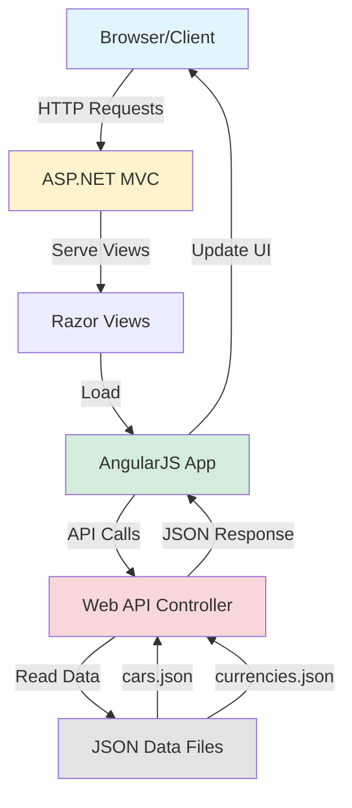

# Cars Shop

A full-stack web application simulating an online car dealership with multi-currency support and dynamic pricing display.

Built in November 2014. This ASP.NET MVC project combines server-side C# with client-side AngularJS 1.6 to create an interactive car shopping experience featuring real-time currency conversion and a modern responsive interface.

## Features

- 🚗 Display car inventory with images and specifications
- 💱 Multi-currency support (USD, EUR, NIS)
- 🎨 Responsive Bootstrap-based UI
- 📊 RESTful API architecture
- 🔄 Dynamic data loading with AngularJS
- 🖼️ Modal dialogs for enhanced user experience
- 📱 Mobile-friendly responsive design

## Architecture



## Technology Stack

### Backend
- **ASP.NET MVC 4** - Web framework
- **C# .NET 4.5** - Server-side language
- **Web API** - RESTful API endpoints
- **JSON** - Data storage

### Frontend
- **AngularJS 1.6** - Client-side framework
- **Bootstrap 3** - CSS framework
- **jQuery** - DOM manipulation
- **HTML5/CSS3** - Markup and styling

### Libraries & Tools
- **Newtonsoft.Json** - JSON serialization
- **UI Bootstrap** - Angular Bootstrap components
- **LESS** - CSS preprocessing

## Getting Started

### Prerequisites

- Visual Studio 2015 or higher
- .NET Framework 4.5 or higher
- IIS Express (included with Visual Studio)
- Modern web browser (Chrome, Firefox, Edge)

### Installation

1. Clone the repository:
```bash
git clone https://github.com/orassayag/cars-shop.git
cd cars-shop
```

2. Open the solution:
```bash
# Open CarShop.sln in Visual Studio
```

3. Update the file path in `CarShop/ApiControllers/CarShopController.cs` (line 24):
```csharp
// Replace with your actual path or use Server.MapPath
using (StreamReader r = new StreamReader(@"YOUR_PATH\CarShop\App_Data\cars.json"))
```

4. Restore NuGet packages:
```
Right-click solution → Restore NuGet Packages
```

5. Build the solution:
```
Build → Build Solution (Ctrl+Shift+B)
```

6. Run the application:
```
Debug → Start Debugging (F5)
```

The application will open at `http://localhost:12172/`

## Project Structure

```
CarShop/
├── App/                    # AngularJS application
│   ├── car-shop/          # Car shop module (controller, service, module)
│   └── modal/             # Modal directive for order dialog
├── App_Data/              # JSON data storage
│   ├── cars.json          # Car inventory data
│   ├── currencies.json    # Currency definitions
│   └── orders.json        # Order history
├── App_Start/             # ASP.NET configuration
│   ├── BundleConfig.cs    # JavaScript/CSS bundling
│   ├── FilterConfig.cs    # Global filters
│   ├── RouteConfig.cs     # MVC routing
│   └── WebApiConfig.cs    # Web API routing
├── ApiControllers/        # Web API controllers
│   └── CarShopController.cs
├── Controllers/           # MVC controllers
│   └── HomeController.cs
├── Content/               # Static assets
│   ├── Images/           # Car images
│   └── *.css             # Stylesheets
├── Helpers/               # Utility classes
│   ├── CurrencyCodeMapper.cs
│   └── Response.cs
├── Models/                # Data models
│   ├── Car.cs
│   ├── Currency.cs
│   └── Price.cs
├── Scripts/               # JavaScript libraries
├── Views/                 # Razor views
│   ├── Home/
│   └── Shared/
└── Web.config             # Application configuration
```

## API Documentation

### Get All Cars

```http
GET /api/CarShop/GetCars
```

**Response:**
```json
{
  "ResponseStatus": true,
  "ResponseMessage": "SUCCESS",
  "ResponseData": [
    {
      "Id": 1,
      "Name": "Infiniti Q70L",
      "Image": "Images\\2015_Infiniti_Q70L_002_8274.jpg",
      "Year": 2015,
      "DisplayPrice": "$19,850.00",
      "Prices": [
        {
          "Id": 1,
          "Amount": 19850.00,
          "Currency": "USD"
        },
        {
          "Id": 2,
          "Amount": 30000.00,
          "Currency": "EUR"
        },
        {
          "Id": 3,
          "Amount": 245000.00,
          "Currency": "NIS"
        }
      ]
    }
  ]
}
```

## Data Structure

### Car Model
```csharp
public class Car {
    public int Id { get; set; }
    public string Name { get; set; }
    public string Image { get; set; }
    public int Year { get; set; }
    public string DisplayPrice { get; set; }
    public List<Price> Prices { get; set; }
}
```

### Price Model
```csharp
public class Price {
    public int Id { get; set; }
    public decimal Amount { get; set; }
    public string Currency { get; set; }
}
```

## Features in Detail

### Multi-Currency Support
The application displays car prices in three currencies:
- **USD** (US Dollar) - Default display currency
- **EUR** (Euro)
- **NIS** (Israeli New Shekel)

Currency symbols are automatically mapped using the `CurrencyCodeMapper` helper class.

### Car Inventory
Cars are stored in `App_Data/cars.json` with the following information:
- Model name and year
- Multiple price points in different currencies
- Image path for display
- Unique identifier

### Angular Architecture
The frontend follows the Angular module pattern:
- **Module** - Defines the application and its dependencies
- **Controller** - Manages the view logic and user interactions
- **Service** - Handles API communication
- **Directive** - Custom modal component for orders

## Development

### Adding New Cars

1. Add car image to `Content/Images/`
2. Add entry to `App_Data/cars.json`:
```json
{
  "Id": 10,
  "ImagePath": "Images\\your-car.jpg",
  "Name": "Your Car Model",
  "Year": 2024,
  "Prices": [
    {"Id": 1, "Name": "USD", "Amount": 50000.00},
    {"Id": 2, "Name": "EUR", "Amount": 45000.00},
    {"Id": 3, "Name": "NIS", "Amount": 180000.00}
  ]
}
```

### Adding New Currencies

1. Update `App_Data/currencies.json`
2. Add currency symbol in `Helpers/CurrencyCodeMapper.cs`
3. Add prices for all cars in the new currency

### Extending the API

1. Add methods to `ApiControllers/CarShopController.cs`
2. Create/update Angular service methods
3. Update controller to use the new endpoints

## Built With

* [ASP.NET MVC](https://www.asp.net/mvc) - Server-side web framework
* [AngularJS 1.6](https://docs.angularjs.org/guide/introduction) - Client-side JavaScript framework
* [Bootstrap 3](https://getbootstrap.com/docs/3.3/) - CSS framework
* [jQuery](https://jquery.com/) - JavaScript library
* [Newtonsoft.Json](https://www.newtonsoft.com/json) - JSON framework for .NET
* [Git](https://git-scm.com) - Source control management

## Contributing

Contributions to this project are [released](https://help.github.com/articles/github-terms-of-service/#6-contributions-under-repository-license) to the public under the [project's open source license](LICENSE).

Everyone is welcome to contribute. Contributing doesn't just mean submitting pull requests—there are many different ways to get involved, including answering questions and reporting issues.

Please read [CONTRIBUTING.md](CONTRIBUTING.md) for details on our code of conduct and the process for submitting pull requests.

For detailed setup and development instructions, see [INSTRUCTIONS.md](INSTRUCTIONS.md).

## Versioning

We use [SemVer](http://semver.org) for versioning. For the versions available, see the [tags on this repository](https://github.com/orassayag/cars-shop/tags).

## Author

* **Or Assayag** - *Initial work* - [orassayag](https://github.com/orassayag)
* Or Assayag <orassayag@gmail.com>
* GitHub: https://github.com/orassayag
* StackOverflow: https://stackoverflow.com/users/4442606/or-assayag?tab=profile
* LinkedIn: https://linkedin.com/in/orassayag

## License

This application has an MIT license - see the [LICENSE](LICENSE) file for details.
